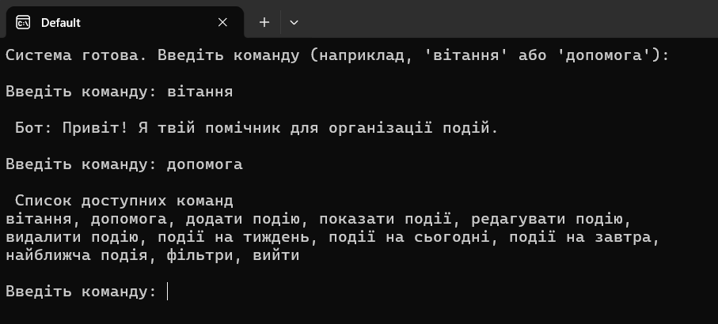
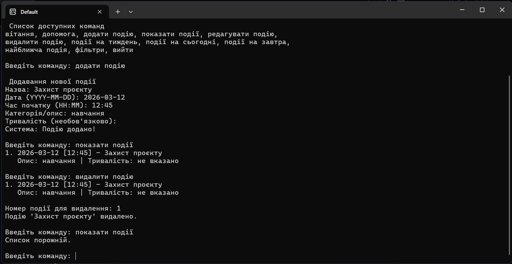

Ярошевич Олександр 472
Варіант 1: Бот “Організатор подій”

Мета проєкту: Створити бота-помічника, який допомагає студенту організовувати події (лекції, зустрічі, іспити, нагадування тощо), працюючи з датами та текстовими запитами.

Цей чатбот консольним додатком, побудованим за архітектурою подійно-орієнтованої логіки, де виконання коду базується на обробці команд користувача. Дані бота зберігаються у форматі JSON. Основний алгоритм бота можна представити такими кроками: запуск, очікування команди, нормалізація, маршрутизація, обробка запиту, збереження. 

Для забезпечення цілісності даних використано модуль datetime. Функція is_valid_datetime перевіряє введені значення через метод strptime і виводить помилку якщо введено неправильну дату. Функція check_conflicts порівнює атрибути date та start_time нової події з усіма існуючими записами

Для зберігання інформації бот використовує JSON-структуру. Дані зберігаються у списку, де кожна подія представлена як словник з фіксованим набором ключів
Формат записів: title, date, start_time, description duration - string
title - Назва події
date - Дата у форматі YYYY-MM-DD
start_time - Час початку у форматі HH:MM
description - Категорія або опис завдання
duration - Тривалість або час завершення (може бути не вказано)

Перед запуском необхідно переконатися, що у вас встановлено мову Python. Встановіть файл з ботом та запустіть його. Вводьте з клавіатури команди для бота, щоб дізнатися їх список використайте команду "допомога". 

Робота команд "вітання" та "допомога":

Створення, перевірка та видалення події:

